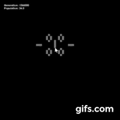

# Juego de la vida

Simulación del juego de la vida en **pygame**. 

# Índice

1. [Índice](Índice)
2. [Breve historia](Brevehistoria)

## Breve historia

El juego de la vida es un automata celular diseñado por el matemático británico Jonh Horton Convway en 1970. Es un juego de cero jugadores en el que su evolución es determinada por un estado inicial, sin requerir intervención adicional. 

Puede ver una descripción más completa y detallada aquí,
<a href="https://es.wikipedia.org/wiki/Juego_de_la_vida" target="_blank">Juego de la vida - Wikipedia</a>

### Reglas

El estado de todas las células se tiene en cuenta para calcular el estado de las mismas al turno siguiente. Todas las células se actualizan simultáneamente en cada turno, siguiendo estas reglas:

*   Una célula muerta con exactamente 3 células vecinas vivas "nace" (es decir, al turno siguiente estará viva).

*   Una célula viva con 2 o 3 células vecinas vivas sigue viva, en otro caso muere (por "soledad" o "superpoblación").

## Descargar

## Compilar 

## Controles
